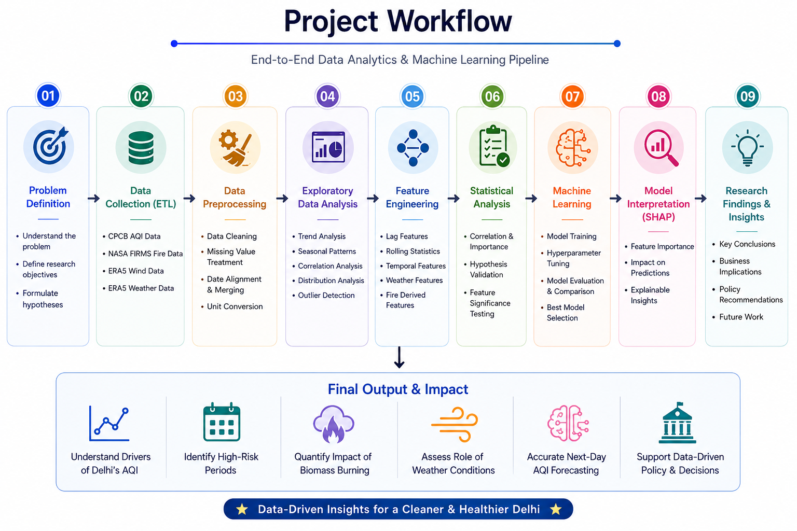
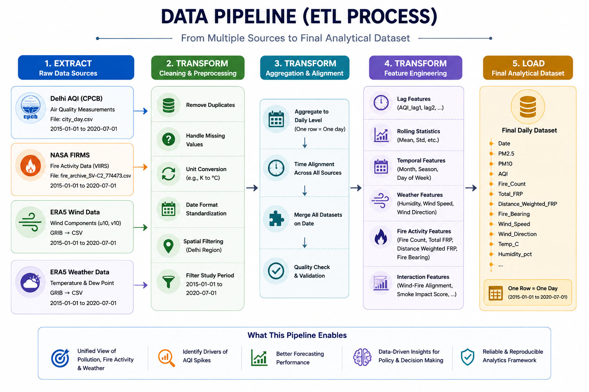
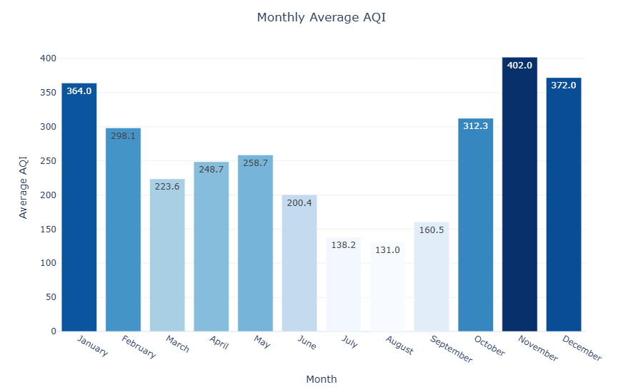
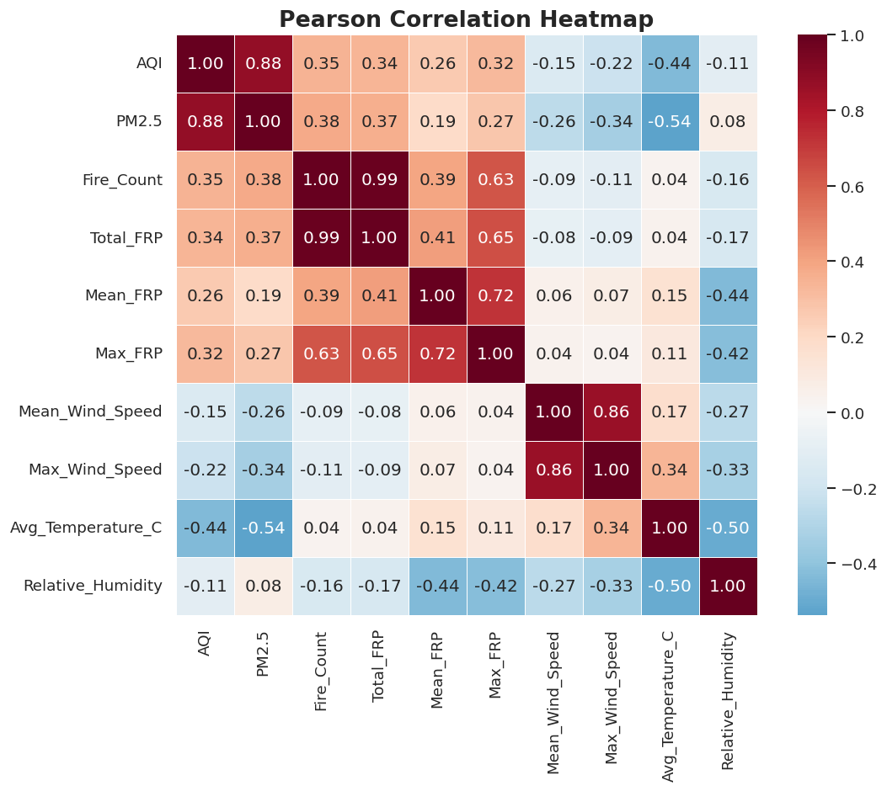
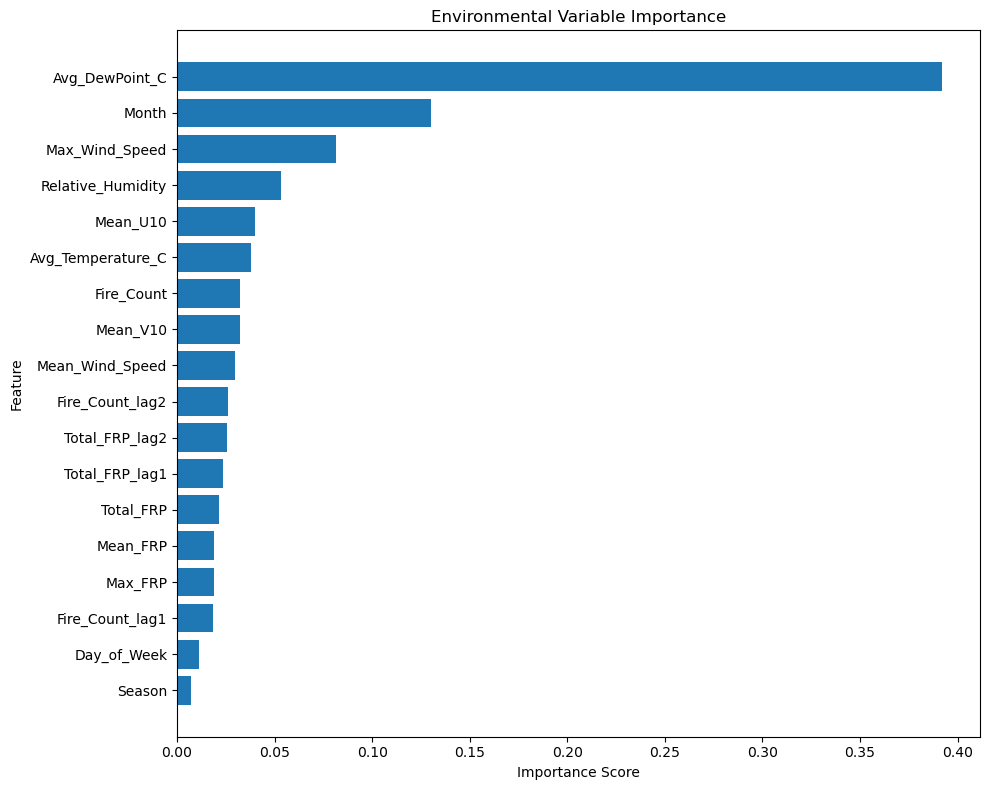
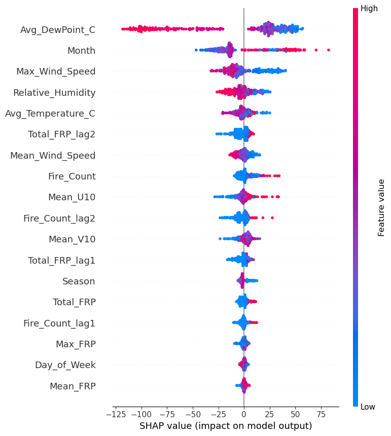
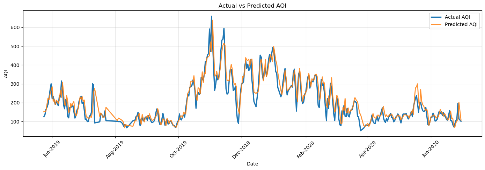

<div align="center">

# 🌍 Delhi AQI Analytics & Forecasting

### Investigating the Impact of Biomass Burning and Meteorological Conditions on Delhi's Air Quality

**End-to-End Data Analytics Project | ETL | EDA | Statistical Analysis | Machine Learning | Explainable AI**


---

*A research-oriented analytics project that integrates pollution, fire activity and weather datasets to understand the factors influencing Delhi's next-day Air Quality Index (AQI).*

</div>

---

# 📌 Business Problem

Delhi frequently experiences hazardous air pollution. While crop residue burning is widely considered a major contributor, meteorological conditions such as wind, humidity and temperature also influence pollutant accumulation.

Understanding the relative contribution of these factors is essential for improving environmental decision-making and short-term AQI forecasting.

---

# 🎯 Project Objectives

- Integrate multiple environmental datasets into a unified analytical dataset.
- Analyze seasonal and temporal pollution trends.
- Quantify the influence of biomass burning on Delhi's AQI.
- Study the role of meteorological conditions in pollution accumulation.
- Forecast next-day AQI using Machine Learning.
- Explain model predictions using Explainable AI (SHAP).

---

# 🔄 Project Workflow

<p align="center">

</p>

---

# ⚙️ ETL Pipeline

Four independent real-world datasets were collected, cleaned and merged into a single day-level analytical dataset.

<p align="center">

</p>

### Data Sources

| Dataset | Purpose |
|---------|---------|
| CPCB Air Quality | Daily AQI and PM2.5 |
| NASA FIRMS | Biomass Burning Activity |
| ERA5 Wind | Wind Transport |
| ERA5 Weather | Temperature & Humidity |

---

# 📊 Exploratory Data Analysis

Exploratory analysis revealed strong seasonal behaviour in Delhi's pollution levels.

Winter months consistently recorded the highest AQI, while the monsoon season showed the lowest pollution due to rainfall and improved atmospheric dispersion.

<p align="center">

</p>

---

Correlation analysis was performed to understand relationships between pollution indicators, fire activity and meteorological variables.

<p align="center">

</p>

---

# 🛠 Feature Engineering

Several predictive variables were created to improve forecasting performance.

### Temporal Features

- Month
- Season
- Day of Week

### Historical Pollution Features

- AQI Lag 1
- AQI Lag 2
- AQI Lag 3
- Rolling Mean
- Rolling Standard Deviation

### Fire Features

- Fire Count
- Fire Radiative Power (FRP)
- Lagged Fire Features

### Weather Features

- Temperature
- Dew Point
- Relative Humidity
- Wind Speed
- Wind Components

---

# 📈 Statistical Analysis

Feature relationships were validated using Pearson correlation and environmental feature importance.

The analysis indicates that **meteorological variables contribute more consistently than fire-related variables** in predicting Delhi's next-day AQI.

<p align="center">

</p>

---

# 🤖 Machine Learning

Three regression models were evaluated.

| Model | Purpose |
|--------|---------|
| Linear Regression | Baseline Model |
| Random Forest | Final Model |
| XGBoost | Performance Comparison |

### Final Model Performance

| Metric | Score |
|---------|-------|
| MAE | 28.34 |
| RMSE | 39.63 |
| R² Score | **0.8767** |

---

# 🔍 Explainable AI

Model predictions were interpreted using SHAP (SHapley Additive exPlanations).

Unlike conventional feature importance, SHAP explains both the magnitude and direction of each feature's contribution, making the model transparent and interpretable.

<p align="center">

</p>

---

# 📉 Model Performance

The Random Forest model closely follows the observed AQI trend and successfully captures both seasonal behaviour and short-term pollution fluctuations.

<p align="center">

</p>

---

# 💡 Key Findings

- Delhi experiences severe seasonal pollution, with winter months recording the highest AQI.
- Dew point, seasonal variation and wind speed were the strongest environmental predictors.
- Biomass burning contributes additional predictive information, particularly during high-burning periods.
- Integrating pollution, fire activity and weather data improves forecasting compared with using pollution history alone.
- SHAP analysis provides transparent explanations for each prediction, improving model interpretability.

---

# 🚀 Future Enhancements

- Automate data collection using CPCB, NASA FIRMS and ERA5 APIs.
- Develop a daily ETL pipeline.
- Deploy an interactive Streamlit dashboard.
- Enable automated next-day AQI prediction.
- Retrain the model periodically using newly available data.

---

# 📂 Repository Structure

```text
Delhi-AQI-Analytics-and-Forecasting
│
├── data
│   ├── raw_data.zip
│   └── README.md
│
├── images
│
├── notebooks
│   ├── 01_Data_Understanding.ipynb
│   ├── 02_Data_Preprocessing.ipynb
│   ├── 03_Exploratory_Data_Analysis.ipynb
│   ├── 04_Feature_Engineering.ipynb
│   ├── 05_Statistical_Analysis_and_Feature_Validation.ipynb
│   ├── 06_Machine_Learning.ipynb
│   └── 07_Model_Interpretation_and_Research_Findings.ipynb
│
├── requirements.txt
├── README.md
└── .gitignore
```

---

# ⚡ Installation

```bash
git clone https://github.com/<your-username>/Delhi-AQI-Analytics-and-Forecasting.git

cd Delhi-AQI-Analytics-and-Forecasting

pip install -r requirements.txt
```

Run the notebooks sequentially:

```
01 → 07
```

---

# 📚 Data Sources

- Central Pollution Control Board (CPCB)
- NASA FIRMS
- Copernicus Climate Data Store (ERA5)

---

# 👨‍💻 Author

**Akash Singh**

MCA Student | Data Analytics | Machine Learning

GitHub: https://github.com/<your-username>

LinkedIn: https://linkedin.com/in/<your-profile>

---

## ⭐ If you found this project useful, consider giving it a star!

## 📄 License

This project is licensed under the MIT License. See the [LICENSE](LICENSE) file for details.