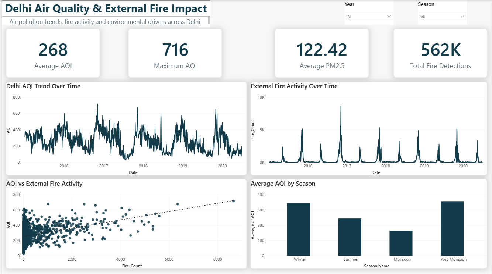
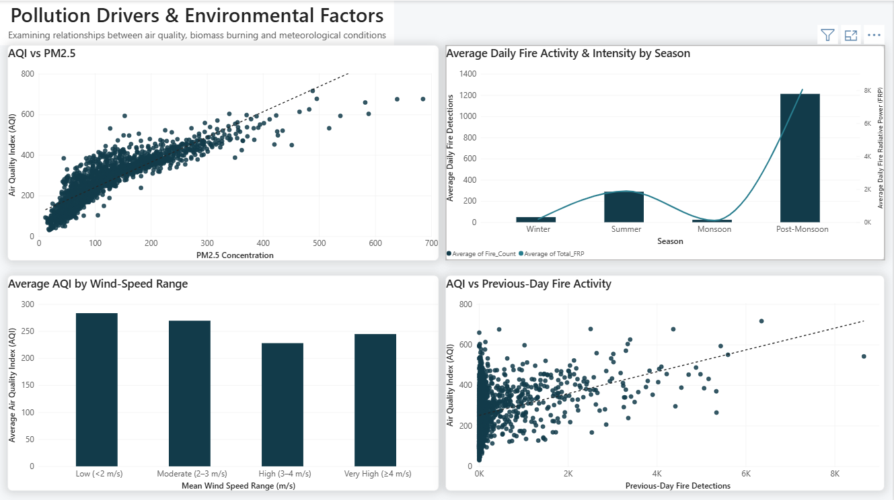
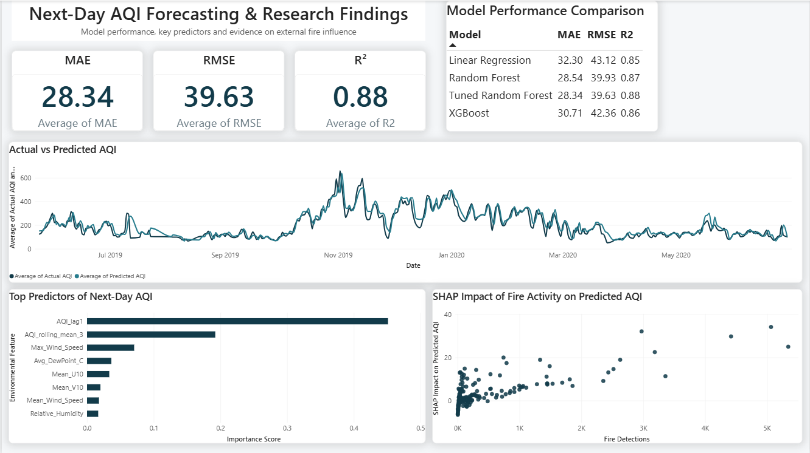

# 🌍 Delhi AQI Analytics & Forecasting

> **An End-to-End Data Analytics Project Investigating the Relationship Between Regional Biomass Burning, Meteorological Conditions, and Delhi's Air Quality**


---

## 📌 Overview

Delhi experiences severe air-pollution episodes resulting from multiple interacting environmental and human factors. Regional biomass burning, historical pollution levels, and meteorological conditions such as wind speed, wind direction, humidity and temperature can all influence the concentration and persistence of pollutants over the city.

This project develops an end-to-end data analytics and machine-learning workflow to investigate these relationships and forecast the next day's Air Quality Index (AQI).

The project integrates:

- **CPCB air-quality data** for AQI and pollutant measurements
- **NASA FIRMS satellite fire data** for regional fire activity
- **ERA5 wind data** for wind speed and direction
- **ERA5 weather data** for temperature, dew point and humidity

The analysis moves from data engineering and exploratory analysis to statistical validation, feature engineering, machine learning, model interpretation and an interactive Power BI dashboard.

A key focus of the project is to investigate whether regional fire activity provides measurable predictive information for Delhi's AQI, including possible delayed effects from fire activity on previous days.

> **Important:** The project investigates relationships and predictive contribution. It does not claim that external fires are the sole cause of Delhi's pollution.

---

## 📊 Project Summary

| Attribute | Details |
|-----------|----------|
| Domain | Environmental Data Analytics |
| Study Area | Delhi, India |
| Study Period | Jan 2015 – Jul 2020 |
| Data Sources | CPCB, NASA FIRMS, ERA5 Wind & Weather |
| Final Dataset | 1,847 Daily Records |
| Engineered Features | 25 |
| Target Variable | Next-Day AQI |
| Final Model | Tuned Random Forest Regressor |
| MAE | **28.34** |
| RMSE | **39.63** |
| R² Score | **0.8767** |
| Dashboard Tool | Power BI |

---

## 🎯 Research Questions

The project is structured around the following questions:

1. How does Delhi's air quality vary over time and across seasons?
2. Is regional fire activity associated with Delhi's AQI?
3. Does fire activity from previous days show a relationship with subsequent AQI?
4. How do meteorological conditions influence AQI?
5. Can next-day AQI be predicted accurately using historical pollution, fire-related and meteorological features?
6. Which variables contribute most to next-day AQI predictions?
7. Does increasing regional fire activity contribute positively to predicted AQI?

---

## 🎯 Objectives

- Integrate multiple environmental datasets into a unified analytical dataset.
- Analyze temporal and seasonal patterns in Delhi's AQI.
- Examine the relationship between regional biomass burning and AQI.
- Investigate possible delayed effects of fire activity.
- Analyze the influence of meteorological conditions on AQI.
- Develop a machine-learning model for next-day AQI forecasting.
- Compare multiple regression models using MAE, RMSE and R².
- Interpret model predictions using feature importance and SHAP.
- Present the findings through an interactive Power BI dashboard.

---

## 🛠 Skills Demonstrated

- Data Collection
- Data Cleaning
- ETL Pipeline Development
- Data Integration
- Exploratory Data Analysis
- Statistical Analysis
- Feature Engineering
- Time-Series Feature Creation
- Machine Learning
- Model Evaluation
- Explainable AI
- SHAP Analysis
- Data Visualization
- Power BI Dashboard Development
- Git & GitHub

---

# 🔄 Project Workflow

<p align="center">

</p>

The project follows the workflow:

**Data Collection → Data Cleaning → Daily Aggregation → Dataset Integration → EDA → Statistical Analysis → Feature Engineering → Model Development → Model Interpretation → Power BI Dashboard**

---

# ⚙️ ETL Pipeline

Four independent real-world datasets were cleaned and transformed before being aggregated to a common daily level and merged using date as the primary key.

The ETL process included:

- Missing-value handling
- Data-type standardization
- Date standardization
- Daily aggregation
- Fire-data processing
- Wind-data processing
- Weather-data processing
- Dataset merging
- Validation of the merged dataset

<p align="center">

</p>

## Data Sources

| Dataset | Purpose |
|----------|---------|
| CPCB Air Quality | AQI, PM2.5 and pollution measurements |
| NASA FIRMS | Fire detections and fire radiative power |
| ERA5 Wind | Wind speed and wind direction |
| ERA5 Weather | Temperature, dew point and humidity |

---

# 🧹 Data Preparation

The datasets were cleaned independently before integration.

### Air Quality Data

The pollution dataset was processed to:

- Standardize the date field
- Handle missing values
- Retain AQI as the main pollution variable
- Prepare pollutant variables for analysis and modelling

### Fire Data

The NASA FIRMS observations were transformed from individual fire detections into daily measurements.

Daily fire features include:

- `Fire_Count`
- `Total_FRP`
- `Distance_Weighted_FRP`
- `Fire_Bearing`

Distance and directional features were created to provide additional information about the spatial relationship between regional fires and Delhi.

### Wind Data

Hourly wind components were aggregated to daily values.

Daily wind speed and wind direction were then calculated from the aggregated wind components.

### Weather Data

Daily averages were derived for:

- Temperature
- Dew point

Relative humidity was calculated from temperature and dew point.

---

# 📈 Exploratory Data Analysis

The exploratory analysis focused on understanding the overall behaviour of Delhi's air quality and its relationship with environmental variables.

Key analyses included:

- Seasonal AQI trends
- Monthly pollution patterns
- Fire activity trends
- Weather behaviour
- AQI and fire relationships
- Correlation analysis

## Seasonal AQI Trend

<p align="center">

</p>

### Observation

- Winter shows the highest average AQI in the analyzed dataset.
- Monsoon shows the lowest average AQI.
- Post-monsoon is another important high-pollution period and also coincides with substantially higher regional fire activity.

---

## Correlation Analysis

<p align="center">

</p>

### Observation

Historical AQI variables show the strongest relationships with future AQI. Meteorological variables also provide meaningful information, while fire-related variables contribute additional predictive information.

Correlation was treated as evidence of association rather than proof of causation.

---

# 📊 Statistical Analysis

Statistical analysis was performed to validate relationships between AQI, fire activity and meteorological variables.

The analysis supported the following observations:

- Historical pollution is strongly related to next-day AQI.
- Meteorological variables significantly influence AQI variation.
- Fire activity has a measurable positive relationship with next-day AQI.
- Fire-related features provide additional information when considered together with pollution and weather variables.

---

# 🧩 Feature Engineering

Domain-specific features were created to capture temporal persistence, fire behaviour, and atmospheric conditions.

## Temporal Features

- `Month`
- `Season`
- `Day_of_Week`

## Historical Pollution Features

- `AQI_lag1`
- `AQI_lag2`
- `AQI_lag3`
- `AQI_rolling_mean_3`
- `AQI_rolling_std_3`

## Fire Features

- `Fire_Count`
- `Total_FRP`
- `Mean_FRP`
- `Max_FRP`
- `Distance_Weighted_FRP`
- `Fire_Bearing`
- `Fire_Count_lag1`
- `Fire_Count_lag2`
- `Total_FRP_lag1`
- `Total_FRP_lag2`

## Weather Features

- `Avg_Temperature_C`
- `Avg_DewPoint_C`
- `Relative_Humidity`
- `Mean_Wind_Speed`
- `Max_Wind_Speed`
- `Mean_U10`
- `Mean_V10`
- `Wind_Direction`

The target variable is:

- `AQI_next_day`

---

# 🤖 Predictive Analytics

Three regression models were evaluated:

| Model | Role |
|--------|------|
| Linear Regression | Baseline |
| Random Forest | Strong baseline and selected model |
| XGBoost | Performance comparison |

Random Forest produced the strongest baseline performance and was subsequently tuned.

## Final Tuned Random Forest Performance

| Metric | Score |
|---------|-------|
| MAE | **28.34** |
| RMSE | **39.63** |
| R² | **0.8767** |

The final tuned Random Forest was selected for detailed prediction and interpretation.

---

# 📉 Actual vs Predicted AQI

The tuned Random Forest was evaluated on the unseen testing period.

<p align="center">

</p>

### Interpretation

The predicted AQI follows the overall temporal pattern of the observed AQI during the testing period.

The model captures:

- Overall pollution variation
- Seasonal behaviour
- Major pollution peaks

Differences are more visible during some extreme AQI periods.

---

# 🔍 Model Explainability

Model interpretation was performed using:

- Feature Importance
- SHAP

The purpose was not only to identify which variables are important, but also to understand how selected variables influence the model's predicted AQI.

## Top Predictors of Next-Day AQI

<p align="center">

</p>

The dashboard presents the most important predictors identified in the model rather than displaying the complete list of features.

The analysis highlights the importance of:

- Historical AQI
- AQI rolling statistics
- Maximum wind speed
- Dew point
- Wind components
- Mean wind speed
- Relative humidity

Fire-related variables also contribute to next-day AQI prediction.

---

## 🔥 SHAP Impact of Fire Activity

<p align="center">

</p>

SHAP analysis was used to understand the contribution of fire activity to the model prediction.

The analysis indicates:

- Increasing `Fire_Count` generally increases predicted AQI.
- Stronger wind generally reduces predicted AQI.
- Meteorological variables also have substantial influence on model predictions.

The fire-related result supports the research focus on whether regional biomass burning provides measurable information for next-day AQI prediction.

---

# 📊 Power BI Dashboard

The project includes a three-page Power BI dashboard designed to convert the analytical and modelling results into a clear visual story.

The dashboard follows this progression:

> **What is happening? → What factors are associated with it? → Can we predict it and explain the prediction?**

---

## 📍 Page 1 — Executive Overview

### Purpose

The first page provides a high-level view of Delhi's AQI, regional fire activity and seasonal pollution patterns.

<p align="center">

</p>

### Visual Guide

| Visual | Purpose |
|--------|---------|
| Average AQI | Shows the overall average AQI for the selected data |
| Maximum AQI | Shows the highest observed AQI |
| Average PM2.5 | Shows average PM2.5 concentration |
| Total Fire Detections | Shows the total number of regional fire detections |
| Delhi AQI Trend Over Time | Shows how AQI changes across the study period |
| External Fire Activity Over Time | Shows changes in regional fire activity over time |
| AQI vs External Fire Activity | Examines the same-day relationship between fire activity and AQI |
| Average AQI by Season | Compares average AQI across the four project seasons |
| Year Slicer | Allows the user to focus on a specific year |
| Season Slicer | Allows the user to focus on a specific season |

### How to Read Page 1

This page answers:

> **What has been happening to Delhi's air quality and regional fire activity?**

The line charts establish the overall temporal pattern, while the season chart identifies seasonal differences. The fire-versus-AQI scatter provides an initial view of the relationship between regional fire activity and pollution.

The Year and Season slicers allow the user to examine a specific period without adding unnecessary filters to the other dashboard pages.

---

# 📍 Page 2 — Pollution Drivers & Environmental Factors

### Purpose

The second page moves from overall trends to environmental relationships.

<p align="center">

</p>

### Visual Guide

| Visual | Purpose |
|--------|---------|
| AQI vs PM2.5 | Examines the relationship between particulate concentration and AQI |
| Average Daily Fire Activity & Intensity by Season | Compares average daily fire detections and average daily FRP by season |
| Average AQI by Wind-Speed Range | Examines how average AQI varies across wind-speed ranges |
| AQI vs Previous-Day Fire Activity | Examines the delayed relationship between previous-day fire activity and current AQI |

### AQI vs PM2.5

This visual shows a strong positive relationship between PM2.5 concentration and AQI.

It demonstrates that higher PM2.5 levels are generally associated with higher AQI.

### Fire Activity & Intensity by Season

This combo chart uses:

- Fire Count for fire frequency
- Total FRP for fire intensity

A secondary axis is used for FRP because fire count and FRP have different scales.

The chart highlights the strong concentration of regional fire activity during the post-monsoon period.

### AQI by Wind-Speed Range

This chart compares AQI under different wind-speed conditions.

In the analyzed data, lower wind-speed ranges are associated with higher average AQI, while stronger wind conditions show lower average AQI.

This supports the role of atmospheric dispersion in pollution behaviour.

### AQI vs Previous-Day Fire Activity

This visual is different from the Page 1 fire scatter.

- **Page 1:** current-day fire activity vs current-day AQI
- **Page 2:** previous-day fire activity vs current AQI

This distinction is important because it allows the project to investigate whether regional fire activity may have a delayed relationship with Delhi's air quality.

### How to Read Page 2

This page answers:

> **What environmental factors are associated with Delhi's AQI, and is there evidence of a delayed relationship with regional fire activity?**

---

# 📍 Page 3 — Forecasting & Research Findings

### Purpose

The third page connects model performance with model interpretation.

<p align="center">

</p>

### Visual Guide

| Visual | Purpose |
|--------|---------|
| MAE Card | Shows the mean absolute prediction error of the final tuned model |
| RMSE Card | Shows the prediction error with greater penalty for larger errors |
| R² Card | Shows the proportion of AQI variation explained by the model |
| Model Performance Comparison | Compares Linear Regression, Random Forest, Tuned Random Forest and XGBoost |
| Actual vs Predicted AQI | Compares observed and predicted AQI throughout the testing period |
| Top Predictors of Next-Day AQI | Shows the variables that contribute most to prediction |
| SHAP Impact of Fire Activity | Shows the direction and strength of fire activity's contribution to predicted AQI |

### Model Performance Cards

The final model achieved:

- **MAE = 28.34**
- **RMSE = 39.63**
- **R² = 0.8767**

### Model Performance Comparison

The model comparison helps explain why the tuned Random Forest was selected rather than presenting its performance in isolation.

The comparison includes:

- Linear Regression
- Random Forest
- Tuned Random Forest
- XGBoost

### Actual vs Predicted AQI

The time-series comparison shows that the tuned Random Forest follows the observed AQI pattern closely over the test period.

This visual is important because the evaluation metrics alone do not show how the model behaves during real pollution peaks.

### Top Predictors of Next-Day AQI

The feature-importance chart shows the strongest predictors used by the model.

Historical AQI variables dominate the overall importance ranking, followed by several meteorological variables such as:

- Maximum wind speed
- Dew point
- Wind components
- Mean wind speed
- Relative humidity

Fire-related variables also provide additional predictive information.

### SHAP Impact of Fire Activity

The SHAP analysis focuses specifically on fire activity to answer a research-oriented question:

> **When fire activity increases, does it push the model's predicted AQI upward or downward?**

The analysis shows a generally positive relationship between `Fire_Count` and SHAP impact, meaning that increasing fire activity generally increases the model's predicted AQI.

### How to Read Page 3

This page answers:

> **How well can next-day AQI be predicted, which variables matter, and what is the contribution of regional fire activity to the prediction?**

---

# 📖 Dashboard Story

The three dashboard pages are intentionally connected.

### Stage 1 — Observe

Page 1 establishes the overall pollution situation.

It shows:

- How AQI changes over time
- When fire activity increases
- How pollution varies across seasons
- Whether fire activity and AQI move together

### Stage 2 — Investigate

Page 2 examines environmental relationships in more detail.

It adds:

- PM2.5
- Fire intensity
- Wind conditions
- Previous-day fire activity

This moves the analysis from simple trends toward possible explanatory factors.

### Stage 3 — Predict and Explain

Page 3 evaluates the forecasting model.

It answers:

- How accurate is the model?
- Which model performed best?
- Does the prediction follow actual AQI?
- Which variables are most important?
- Does increasing fire activity increase predicted AQI?

The overall analytical story is therefore:

**Observation → Relationship Analysis → Prediction → Explanation**

---

# 💡 Key Findings

Based on the completed analysis and dashboard:

- Delhi shows strong seasonal variation in AQI.
- Winter has the highest average AQI in the analyzed dataset.
- Monsoon has the lowest average AQI.
- Post-monsoon is associated with substantially higher regional fire activity.
- PM2.5 has a strong positive relationship with AQI.
- Lower wind-speed conditions are associated with higher average AQI in the analyzed dataset.
- Current-day fire activity shows a positive association with AQI.
- Previous-day fire activity also shows a positive relationship with current AQI.
- Historical AQI variables are among the strongest predictors of next-day AQI.
- Meteorological variables such as dew point, maximum wind speed and humidity provide substantial predictive information.
- Fire-related variables provide additional predictive information.
- SHAP analysis indicates that increasing fire activity generally increases predicted AQI.
- Stronger wind generally reduces predicted AQI, consistent with improved pollutant dispersion.
- The final tuned Random Forest achieved **R² = 0.8767** with **MAE = 28.34** and **RMSE = 39.63**.

> **Research interpretation:** The results support a measurable association and predictive contribution from regional fire activity, but they should not be interpreted as proof that external fires alone cause Delhi's pollution. Delhi's AQI is influenced by multiple interacting factors.

---

# 🧠 What the Project Demonstrates

This project combines several stages of practical data analytics into one workflow:

**Data Engineering**
→ Multiple real-world environmental datasets were cleaned, transformed and integrated.

**Exploratory Analysis**
→ Pollution, fire and weather patterns were investigated.

**Statistical Analysis**
→ Relationships were tested instead of relying only on visual observations.

**Feature Engineering**
→ Temporal, lagged, fire-related and meteorological features were created.

**Machine Learning**
→ Multiple regression models were benchmarked and the strongest model was tuned.

**Explainable AI**
→ Feature importance and SHAP were used to interpret model behaviour.

**Business/Stakeholder Visualization**
→ The final results were converted into an interactive Power BI dashboard.

---

# 🚀 Future Enhancements

- Automate data collection using CPCB, NASA FIRMS and ERA5 APIs.
- Build a scheduled ETL pipeline for daily updates.
- Automate next-day AQI forecasting.
- Retrain the model periodically with newly available observations.
- Extend spatial analysis to more fire-source regions.
- Integrate additional pollution sources and atmospheric transport variables.
- Deploy the forecasting workflow as an interactive application.
- Extend the Power BI dashboard to support automatically refreshed data.

---

# 📂 Repository Structure

```text
Delhi-AQI-Analytics-and-Forecasting/
│
├── data/
│   ├── README.md
│   └── raw_data.zip
│
├── dashboard/
│   └── Delhi_AQI_Dashboard.pbix
│
├── images/
│   ├── project_workflow.png
│   ├── etl_pipeline.png
│   ├── seasonal_aqi_trend.png
│   ├── correlation_heatmap.png
│   ├── actual_vs_predicted.png
│   ├── environmental_feature_importance.png
│   ├── shap_summary.png
│   ├── dashboard_executive_overview.png
│   ├── dashboard_pollution_drivers.png
│   └── dashboard_forecasting_findings.png
│
├── notebooks/
│   ├── 01_Data_Understanding.ipynb
│   ├── 02_Data_Preprocessing.ipynb
│   ├── 03_Exploratory_Data_Analysis.ipynb
│   ├── 04_Feature_Engineering.ipynb
│   ├── 05_Statistical_Analysis_and_Feature_Validation.ipynb
│   ├── 06_Machine_Learning.ipynb
│   └── 07_Model_Interpretation_and_Research_Findings.ipynb
│
├── requirements.txt
├── README.md
└── LICENSE
```

---

## ⚡ Installation

```bash
git clone https://github.com/Akash-0012/Delhi-AQI-Analytics-and-Forecasting.git

cd Delhi-AQI-Analytics-and-Forecasting

pip install -r requirements.txt
```

Run the notebooks sequentially:

```
01 → 07
```

---

## 📚 Data Sources

- Central Pollution Control Board (CPCB)
- NASA FIRMS
- Copernicus Climate Data Store (ERA5)

Detailed download instructions are available in **`data/README.md`**.

---

## 👨‍💻 Author

**Akash Singh**

Aspiring Data Analyst | Python | SQL | Machine Learning

- GitHub: https://github.com/Akash-0012
- LinkedIn: *(Add your LinkedIn profile URL)*

---

## 📄 License

This project is licensed under the MIT License. See the `LICENSE` file for details.

⭐ If you found this project useful, consider giving it a star!
